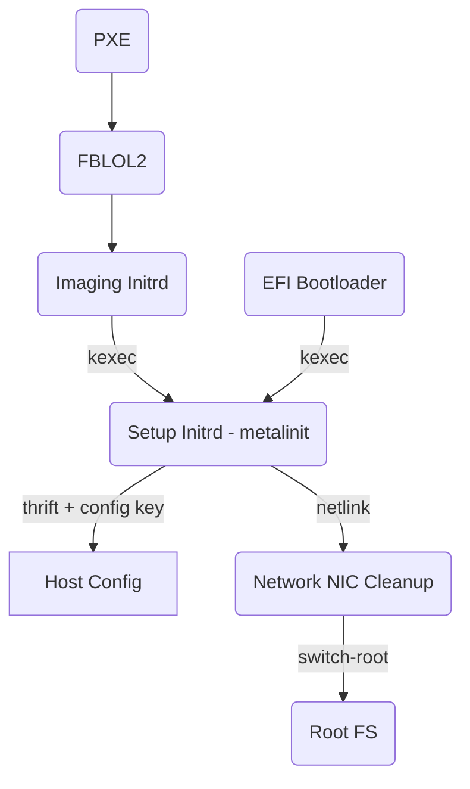

# Network Boot

MetalOS systems boot over the network for initial provisioning.
This is accomplished via `//metallos/imaging_initrd:imaging-initrd` which then
lays down the initial disk partition layout.

# Disk Boot

After the first provisioning boot, MetalOS can reboot fresh from the disk, via
an EFI bootloader built as a part of MetalOS.

## EFI Bootloader

MetalOS ships with an EFI bootloader based on
[systemd-stub](https://www.freedesktop.org/software/systemd/man/systemd-stub.html).
This bootloader is composed of a small initrd (`//metalos/bootloader:initrd`)
that is built using a standard production kernel and the required disk boot
driver modules.

The disk bootloader directly understands the MetalOS `HostConfig`, and allows us
to not have to worry about ever managing an external system's boot configuration
as we would for other bootloaders like grub or systemd-boot

### Updating the Bootloader

The bootloader binary will be part of the host's `BootConfig` and is installed
by the imaging initrd during imaging, and updated by the rootfs as part of the
standard offline update implementation for rootfs+kernel upgrades.

# Setup Initrd

The setup initrd is the most active piece of MetalOS infrastructure when booting
a machine. It is responsible for:

- finding and mounting the root disk
- reading the `HostConfig`
- setting up the rootfs subvolume layout, etc.
- renaming NIC names to match Serf (Meta is still a ethX world)

# Boot Flow

Both boot operations quickly converge on the same flow, where the only
difference is how they execute the Setup Initrd

