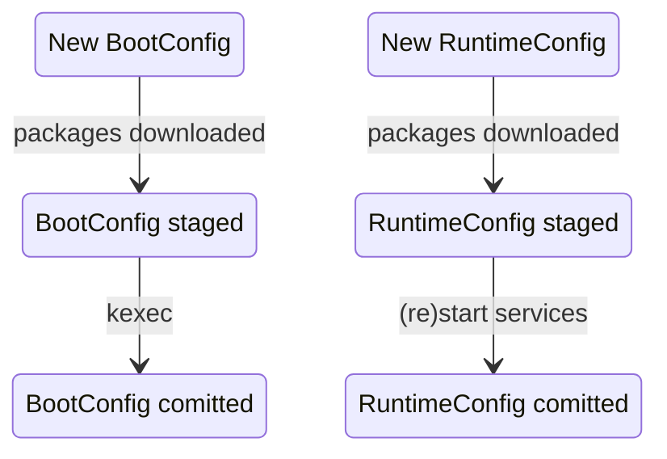

A top-level MetalOS `HostConfig` is composed of 3 different pieces, each of
which can change at specific times.

### ProvisioningConfig
`ProvisioningConfig` holds information that is constant for the entire lifetime
of a named host. Fields in this config are only allowed to change when the host
is completely reprovisioned, and thus include things like the hostname and IP
addresses.

### BootConfig
`BootConfig` can change only on kexec/reboot boundaries, since it configures
parts of the host that cannot be changed without workload downtime (mainly the
rootfs and kernel versions)

### RuntimeConfig
Lastly, `RuntimeConfig` can change at any point in a host's lifecycle. It
primarily consists of the versions of all [Native Services](native-services.md)
that are running on a host.

## Transitions

The transition labels in this state diagram show what is needed to effect a
transition when different levels of the host's config change.

