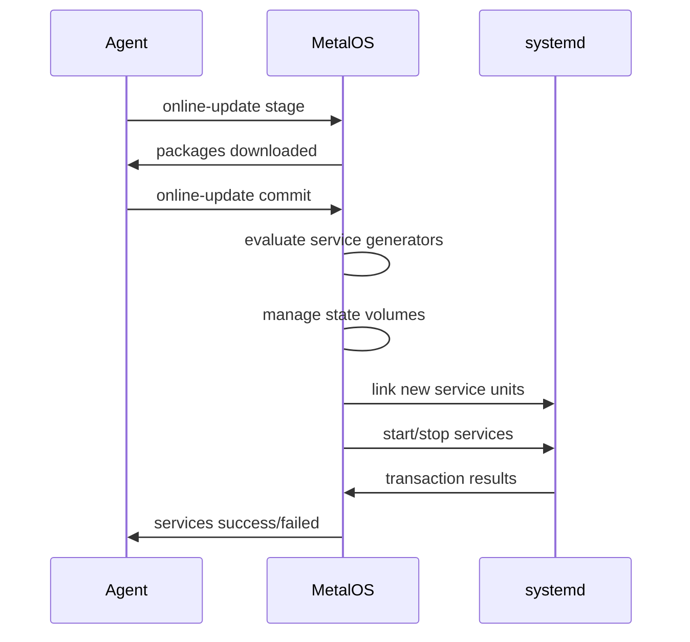
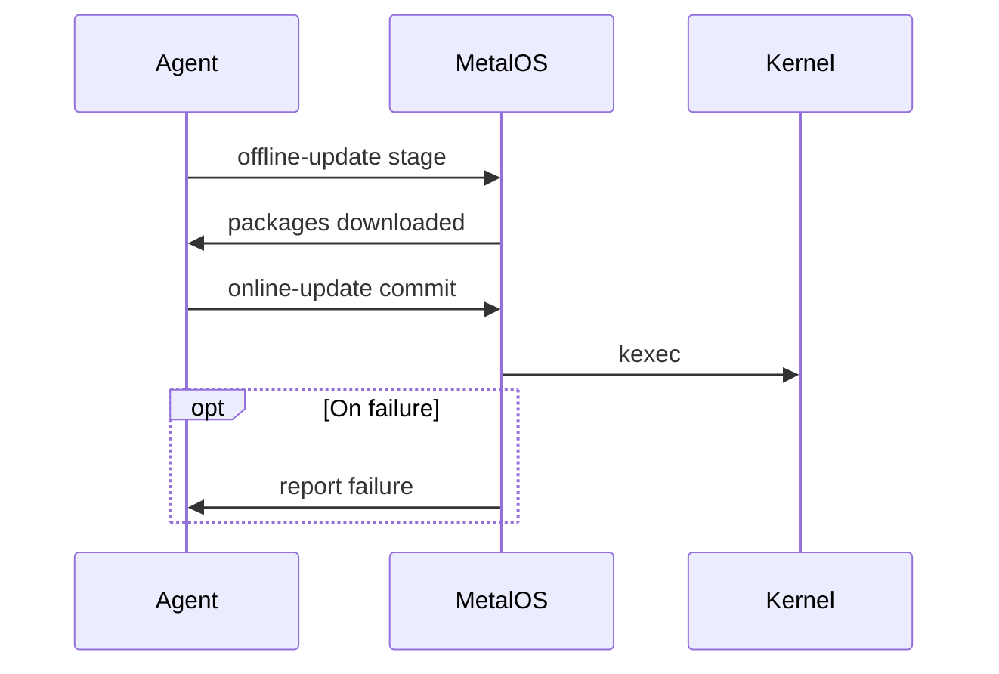

In the following diagrams, "Agent" is some on-host tool that calls
`metalctl {online,offline}-update` after determining the desired host state.
MetalOS then acts on the running system to arrive at the given host state.

## Online Update
This updates the `RuntimeConfig` (running versions of native services)

## Offline Update
This updates the `BootConfig` (primarily rootfs and kernel)

